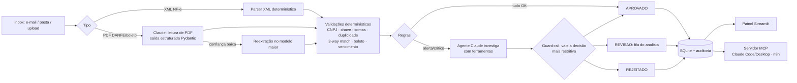

# Agente de Contas a Pagar (NF-e e boletos)

Agente de IA que automatiza a entrada de documentos fiscais no Contas a Pagar: lê a NF-e (XML ou DANFE em
PDF) e o boleto, valida tudo, faz o **3-way match** (nota × pedido de compra × recebimento físico), barra
fraudes e duplicidades, e entrega ao analista uma fila só com as exceções, cada uma já explicada.

Construído com **Claude Code**. Usa a **Claude API** para ler PDFs e investigar exceções, e um **servidor MCP**
para que o analista (ou o n8n) converse com o agente.

## A dor

| Hoje (manual) | Com o agente |
|---|---|
| Analista abre e-mail, baixa XML/PDF e digita no ERP/planilha (5–10 min por nota) | Ingestão e extração automáticas, segundos por documento |
| Conferência com o pedido "no olho", por amostragem | 100% das notas conferidas item a item contra pedido e recebimento |
| Pagamento em duplicidade quando o fornecedor reenvia a nota | Bloqueio por chave de acesso, número+emitente e hash do arquivo |
| Golpe do boleto adulterado (beneficiário trocado) | Boleto conferido contra cadastro, DVs da linha digitável e nota de lastro |
| Multa/juros por perder vencimento | Relatório de vencimentos e prioridade automática (≤ 3 dias) |
| Sem rastreabilidade de quem aprovou o quê | Trilha de auditoria append-only (agente, regra ou analista) |

## Como funciona



Princípios de projeto:

- **Determinístico onde dá, IA onde precisa.** O XML da NF-e é estruturado, então lê-lo com LLM seria
  custo e risco sem ganho. A IA entra no que exige interpretação: PDFs sem XML e investigação de exceções.
- **A IA nunca afrouxa a regra.** A decisão final é a mais restritiva entre o motor de regras e o agente.
  O agente pode mandar para revisão algo que as regras aprovariam, mas nunca aprovar o que elas bloquearam
  (`ap_agent/agente.py`, testado em `test_guardrail_llm_nao_pode_ser_mais_permissivo`).
- **Tokens só nas exceções.** Documento limpo é aprovado pelas regras sem chamar o agente.
- **Funciona sem chave de API.** Modo offline: regras + extração de PDF por regex. Como a confiança é baixa,
  o PDF vai para revisão. Assim a demo roda em qualquer máquina.

## Estrutura

```
desafio1-agente-nf/
├── ap_agent/
│   ├── config.py          # variáveis de ambiente (.env)
│   ├── models.py          # schemas Pydantic (documento, verificação, decisão)
│   ├── brutils.py         # CNPJ, chave de acesso (mod 11), boleto FEBRABAN (mod 10/11, fator de vencimento)
│   ├── extract/
│   │   ├── nfe_xml.py     # parser NF-e 4.00
│   │   └── pdf_documento.py  # Claude (structured outputs) + fallback regex
│   ├── cadastros.py       # fornecedores, pedidos, recebimentos (CSV na demo, ERP em produção)
│   ├── validacao.py       # regras de negócio (OK / ALERTA / CRITICO)
│   ├── agente.py          # motor de regras + agente Claude com ferramentas + guard-rail
│   ├── store.py           # SQLite: documentos, verificações, auditoria
│   ├── pipeline.py        # orquestração
│   └── __main__.py        # CLI
├── mcp_server.py          # servidor MCP (stdio ou HTTP)
├── dashboard.py           # painel Streamlit
├── scripts/gerar_dados_ficticios.py
├── tests/test_agente.py
└── docs/
    ├── arquitetura.md
    └── plano-implantacao.md
```

## Como rodar

Pré-requisito: Python 3.10+.

```bash
cd desafio1-agente-nf
pip install -r requirements.txt
cp .env.example .env            # opcional: preencha ANTHROPIC_API_KEY para o modo com IA

python scripts/gerar_dados_ficticios.py --limpar   # 11 documentos fictícios na inbox/
python -m ap_agent processar                      # processa a inbox (use --offline para forçar sem IA)
python -m ap_agent pendencias                     # fila de revisão
python -m ap_agent vencimentos --dias 7
python -m ap_agent exportar                       # data/export/lancamentos.xlsx

streamlit run dashboard.py                        # painel do analista
python -m pytest -q                               # testes
```

### Cenários da demo

| Arquivo | Cenário | Resultado |
|---|---|---|
| `nfe_001_aco_ok.xml` | NF-e correta | APROVADO |
| `nfe_002_embalagens_ok.xml` | NF-e com 2 itens | APROVADO |
| `boleto_002_embalagens.pdf` | Boleto da NF 002 (beneficiário, valor e DVs conferem) | APROVADO |
| `nfe_003_lubrificante_preco_acima.xml` | Preço 8% acima do pedido (tolerância 2%) | REVISAO |
| `nfe_004_epi_qtd_maior_que_recebida.xml` | Cobrou 500 luvas, almoxarifado recebeu 400 | REVISAO |
| `nfe_005_fornecedor_desconhecido.xml` | Emitente fora do cadastro | REJEITADO |
| `nfe_006_duplicada_do_001.xml` | Reenvio da NF 001 (duplicidade) | REJEITADO |
| `nfe_007_chave_invalida.xml` | Chave de acesso adulterada | REJEITADO |
| `danfe_008_frete_somente_pdf.pdf` | Só DANFE em PDF | APROVADO com IA / REVISAO offline |
| `boleto_009_fraude_beneficiario.pdf` | Golpe do boleto: nome do fornecedor real, CNPJ de terceiro | REJEITADO |
| `nfe_010_paletes_vence_em_2_dias.xml` | Correta, vence em 2 dias | APROVADO + PRIORIDADE |

## Integração MCP

O `mcp_server.py` expõe o agente como ferramentas MCP:

| Ferramenta | O que faz |
|---|---|
| `processar_documentos(arquivo?)` | Processa os arquivos novos da inbox (ou um específico) |
| `listar_pendencias()` | Fila de revisão com motivos |
| `listar_documentos(status?)` | Lançamentos por status |
| `detalhar_documento(id)` | Dados extraídos + todas as verificações |
| `decidir_pendencia(id, aprovar, justificativa, analista)` | Decisão humana (auditada) |
| `relatorio_vencimentos(dias)` | Títulos a pagar no horizonte, com total |
| `consultar_fornecedor(cnpj)` | Cadastro + histórico |
| recurso `contas-a-pagar://kpis` | Indicadores do processo |

**Claude Code:**

```bash
claude mcp add contas-a-pagar -- python "C:/caminho/para/desafio1-agente-nf/mcp_server.py"
```

Depois, em linguagem natural: *"processe as notas novas e me diga o que precisa da minha atenção"*,
*"aprove a pendência 4, o reajuste foi acordado por e-mail"*, *"quanto pago esta semana?"*.

**n8n / outros clientes HTTP:** `python mcp_server.py --http` sobe em `http://127.0.0.1:8000/mcp`.
O nó *MCP Client Tool* do n8n consome essas ferramentas. Isso conecta o Desafio 1 ao Desafio 2.

## Modelos e custos (Claude API)

| Uso | Modelo padrão | Quando roda |
|---|---|---|
| Extração de PDF | `claude-haiku-4-5` ($1 / $5 por MTok) | Só para PDFs (XML não usa IA) |
| Reextração | `claude-sonnet-5-5` ($2 / $10 por MTok) | Só se a confiança < 85% |
| Agente investigador | `claude-sonnet-5-5` | Só para documentos com alerta/crítico |

Os modelos são configuráveis no `.env`. Estimativas de custo mensal estão no [plano de implantação](docs/plano-implantacao.md#4-custos).

## Limitações conhecidas

- **Cadastros em CSV:** em produção vêm do ERP (camada isolada em `cadastros.py`).
- **Ingestão por pasta:** em produção, IMAP/Graph API ou n8n gravando na inbox.
- **Sem consulta à SEFAZ:** a situação da NF-e (autorizada/cancelada) entra na fase de integração.
- **Impostos:** o agente não recalcula ICMS/IPI/retenções, só confere somas.
- **Teste do modo com IA:** a suíte cobre o loop do agente com um cliente simulado. A validação com a API
  real exige `ANTHROPIC_API_KEY`.
