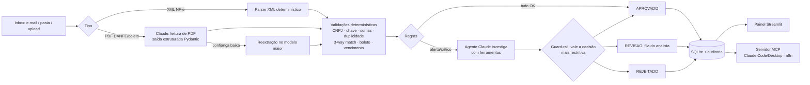

# Agente de Contas a Pagar (NF-e e boletos)

Agente de IA que automatiza a entrada de documentos fiscais no Contas a Pagar: lê a NF-e (XML ou DANFE em
PDF) e o boleto, valida tudo, faz o **3-way match** (nota × pedido de compra × recebimento físico), barra
fraudes e duplicidades, e entrega ao analista uma fila só com as exceções, cada uma já explicada.

Construído com **Claude Code**. Usa IA (Claude, ou um modelo gratuito via OpenRouter) para ler PDFs e investigar exceções, e um **servidor MCP**
para que o analista (ou o n8n) converse com o agente.

## A dor

| Hoje (manual) | Com o agente |
|---|---|
| Analista abre e-mail, baixa XML/PDF e digita no ERP/planilha (5–10 min por nota) | Ingestão e extração automáticas, segundos por documento |
| Conferência com o pedido "no olho", por amostragem | 100% das notas conferidas item a item contra pedido e recebimento |
| Pagamento em duplicidade quando o fornecedor reenvia a nota | Bloqueio por chave de acesso, número+emitente e hash do arquivo |
| Golpe do boleto adulterado (beneficiário trocado) | Boleto conferido contra cadastro, DVs da linha digitável e nota de lastro |
| Multa/juros por perder vencimento | Relatório de vencimentos e prioridade automática (≤ 3 dias) |
| Sem rastreabilidade de quem aprovou o quê | Trilha de auditoria append-only (agente, regra ou analista) |

## Como funciona



Princípios de projeto:

- **Determinístico onde dá, IA onde precisa.** O XML da NF-e é estruturado, então lê-lo com LLM seria
  custo e risco sem ganho. A IA entra no que exige interpretação: PDFs sem XML e investigação de exceções.
- **A IA nunca afrouxa a regra.** A decisão final é a mais restritiva entre o motor de regras e o agente.
  O agente pode mandar para revisão algo que as regras aprovariam, mas nunca aprovar o que elas bloquearam
  (`ap_agent/agente.py`, testado em `test_guardrail_llm_nao_pode_ser_mais_permissivo`).
- **Tokens só nas exceções.** Documento limpo é aprovado pelas regras sem chamar o agente.
- **Funciona sem chave de API.** Modo offline: regras + extração de PDF por regex. Como a confiança é baixa,
  o PDF vai para revisão. Assim a demo roda em qualquer máquina.

## Estrutura

```
desafio1-agente-nf/
├── ap_agent/
│   ├── config.py          # variáveis de ambiente (.env)
│   ├── models.py          # schemas Pydantic (documento, verificação, decisão)
│   ├── brutils.py         # CNPJ, chave de acesso (mod 11), boleto FEBRABAN (mod 10/11, fator de vencimento)
│   ├── extract/
│   │   ├── nfe_xml.py     # parser NF-e 4.00
│   │   └── pdf_documento.py  # IA (via llm.py) + fallback regex
│   ├── cadastros.py       # fornecedores, pedidos, recebimentos (CSV na demo, ERP em produção)
│   ├── validacao.py       # regras de negócio (OK / ALERTA / CRITICO)
│   ├── llm.py             # provedores de IA: Claude ou API compatível com OpenAI (OpenRouter/Qwen)
│   ├── agente.py          # motor de regras + agente com ferramentas + guard-rail
│   ├── ingest_email.py    # leitura de e-mail (IMAP) e download dos anexos
│   ├── store.py           # SQLite: documentos, verificações, auditoria
│   ├── pipeline.py        # orquestração
│   └── __main__.py        # CLI
├── mcp_server.py          # servidor MCP (stdio ou HTTP)
├── dashboard.py           # painel Streamlit
├── scripts/
│   ├── gerar_dados_ficticios.py
│   └── preparar_notas_reais.py   # ambiente separado para testar com NF-e reais
├── tests/test_agente.py
└── docs/
    ├── arquitetura.md
    └── plano-implantacao.md
```

## Como rodar

Pré-requisito: Python 3.10+.

```bash
cd desafio1-agente-nf
pip install -r requirements.txt
cp .env.example .env            # opcional: preencha ANTHROPIC_API_KEY para o modo com IA

python scripts/gerar_dados_ficticios.py --limpar   # 11 documentos fictícios na inbox/
python -m ap_agent processar                      # processa a inbox (use --offline para forçar sem IA)
python -m ap_agent ler-email                      # busca notas no e-mail (veja abaixo)
python -m ap_agent pendencias                     # fila de revisão
python -m ap_agent vencimentos --dias 7
python -m ap_agent exportar                       # data/export/lancamentos.xlsx

streamlit run dashboard.py                        # painel do analista
python -m pytest -q                               # testes
```

### Cenários da demo

| Arquivo | Cenário | Resultado |
|---|---|---|
| `nfe_001_aco_ok.xml` | NF-e correta | APROVADO |
| `nfe_002_embalagens_ok.xml` | NF-e com 2 itens | APROVADO |
| `boleto_002_embalagens.pdf` | Boleto da NF 002 (beneficiário, valor e DVs conferem) | APROVADO |
| `nfe_003_lubrificante_preco_acima.xml` | Preço 8% acima do pedido (tolerância 2%) | REVISAO |
| `nfe_004_epi_qtd_maior_que_recebida.xml` | Cobrou 500 luvas, almoxarifado recebeu 400 | REVISAO |
| `nfe_005_fornecedor_desconhecido.xml` | Emitente fora do cadastro | REJEITADO |
| `nfe_006_duplicada_do_001.xml` | Reenvio da NF 001 (duplicidade) | REJEITADO |
| `nfe_007_chave_invalida.xml` | Chave de acesso adulterada | REJEITADO |
| `danfe_008_frete_somente_pdf.pdf` | Só DANFE em PDF | APROVADO com IA / REVISAO offline |
| `boleto_009_fraude_beneficiario.pdf` | Golpe do boleto: nome do fornecedor real, CNPJ de terceiro | REJEITADO |
| `nfe_010_paletes_vence_em_2_dias.xml` | Correta, vence em 2 dias | APROVADO + PRIORIDADE |

## Integração MCP

O `mcp_server.py` expõe o agente como ferramentas MCP:

| Ferramenta | O que faz |
|---|---|
| `processar_documentos(arquivo?)` | Processa os arquivos novos da inbox (ou um específico) |
| `listar_pendencias()` | Fila de revisão com motivos |
| `listar_documentos(status?)` | Lançamentos por status |
| `detalhar_documento(id)` | Dados extraídos + todas as verificações |
| `decidir_pendencia(id, aprovar, justificativa, analista)` | Decisão humana (auditada) |
| `relatorio_vencimentos(dias)` | Títulos a pagar no horizonte, com total |
| `consultar_fornecedor(cnpj)` | Cadastro + histórico |
| `buscar_emails(processar?)` | Lê a caixa de e-mail, baixa anexos XML/PDF e processa |
| recurso `contas-a-pagar://kpis` | Indicadores do processo |

**Claude Code:**

```bash
claude mcp add contas-a-pagar -- python "C:/caminho/para/desafio1-agente-nf/mcp_server.py"
```

Depois, em linguagem natural: *"busque as notas no e-mail"*, *"processe as notas novas e me diga o que precisa da minha atenção"*,
*"aprove a pendência 4, o reajuste foi acordado por e-mail"*, *"quanto pago esta semana?"*.

**n8n / outros clientes HTTP:** `python mcp_server.py --http` sobe em `http://127.0.0.1:8000/mcp`.
O nó *MCP Client Tool* do n8n consome essas ferramentas. Isso conecta o Desafio 1 ao Desafio 2.

## Receber notas por e-mail (IMAP)

O agente lê uma caixa de e-mail, baixa os anexos `.xml` e `.pdf` das mensagens **não lidas** para a inbox
e já processa cada documento. As mensagens são marcadas como lidas, nunca apagadas. Outros anexos são
ignorados, há limite de 10 MB por arquivo e o nome do anexo é sanitizado. Cada e-mail gera o evento
`EMAIL_RECEBIDO` na auditoria.

Configuração com Gmail (caixa criada só para o teste):

1. Ative a **verificação em duas etapas** em <https://myaccount.google.com/security>.
2. Crie uma **senha de app** em <https://myaccount.google.com/apppasswords>.
3. No `.env`, preencha `AP_EMAIL_USUARIO` e `AP_EMAIL_SENHA` (os 16 caracteres, sem espaços).
4. Envie para essa caixa um e-mail com notas anexadas e rode uma destas opções:
   - `python -m ap_agent ler-email` (`--so-baixar` só salva os anexos);
   - o botão **Buscar e-mails** no painel;
   - a ferramenta MCP `buscar_emails`.

Outros provedores: ajuste `AP_EMAIL_IMAP_HOST`, por exemplo `outlook.office365.com`.

## Testar com notas reais

Notas reais não estão no cadastro e não têm pedido de compra, então seriam todas rejeitadas.
O script abaixo cria, a partir das próprias notas, um ambiente separado em `notas_reais/` (fora do git):

- o emitente como fornecedor;
- um pedido e um recebimento com os mesmos itens;
- um prazo de pagamento, porque compras pessoais vêm sem duplicata.

```bash
python scripts/preparar_notas_reais.py "C:/pasta/com/xmls" --processar               # pedido igual: APROVADO
python scripts/preparar_notas_reais.py "C:/pasta/com/xmls" --divergente --processar  # pedido 5% menor: REVISAO
```

Duas funções do agente aparecem aqui e também valem em produção:

- **Pedido identificado automaticamente:** quando a nota não informa o pedido (`xPed`), o agente procura o
  único pedido do mesmo fornecedor que contém todos os itens.
- **Prazo padrão do fornecedor:** sem duplicata na nota, o vencimento é a emissão mais a coluna
  `prazo_pagamento_dias` do cadastro.

Para abrir o painel sobre esse ambiente, defina as pastas antes de iniciar:

```powershell
$env:AP_DATA_DIR = "<...>\notas_reais\data"
$env:AP_INBOX_DIR = "<...>\notas_reais\inbox"
streamlit run dashboard.py
```

Aceita NF-e (modelo 55) e NFC-e em XML. DANFE em PDF real, sem IA, vai para revisão: a regex foi feita
para o layout da demo.

## Modelos de IA e custos

A IA é configurável no `.env` (`AP_LLM_PROVEDOR`). Sem chave, tudo funciona em modo offline.

| Provedor | Configuração | Observações |
|---|---|---|
| **Claude** (padrão) | `ANTHROPIC_API_KEY` | Lê PDF nativamente; extração com `claude-haiku-4-5` ($1 / $5 por MTok), reextração e agente com `claude-sonnet-5-5` ($2 / $10) |
| **OpenRouter** (modelos gratuitos, ex.: Qwen) | `AP_LLM_PROVEDOR=openai_compat`, `AP_LLM_BASE_URL`, `AP_LLM_API_KEY`, `AP_LLM_MODELO` | Grátis com limite diário. Modelos de texto: o PDF é convertido em texto antes (não lê PDF escaneado). Use só com dados fictícios ou seus |
| **Ollama** (local) | `AP_LLM_BASE_URL=http://localhost:11434/v1`, `AP_LLM_API_KEY=ollama` | Privado e sem custo, mas pesado para a máquina |

Para o modelo gratuito do OpenRouter, escolha em <https://openrouter.ai/models> um modelo com sufixo
`:free` e suporte a *tools*, e coloque o id em `AP_LLM_MODELO`. Se o modelo falhar, sair do ar ou
devolver JSON inválido, o sistema volta sozinho para regex e regras.

Estimativas de custo mensal em produção estão no [plano de implantação](docs/plano-implantacao.md#4-custos).

## Validação com modelo real (06/10/2026)

Executado com `nvidia/nemotron-3-super-120b-a12b:free` via OpenRouter. Hoje não há Qwen gratuito com suporte a ferramentas no OpenRouter.

| Teste | Resultado |
|---|---|
| Demonstração completa (11 documentos) | 5 aprovados, 2 em revisão, 4 rejeitados, exatamente o esperado com IA |
| DANFE em PDF (`danfe_008`) | Lida pelo modelo (CNPJ, valor, vencimento, pedido, item) e aprovada |
| Exceções (6 documentos) | Investigadas pelo agente, que consultou ferramentas e escreveu justificativa e ação sugerida; o guard-rail manteve os 4 rejeitados |
| E-mail real (Gmail, IMAP) | 5 mensagens não lidas lidas e marcadas; anexos XML/PDF salvos e processados; e-mails sem anexo ignorados |
| Documento real recebido por e-mail | NFS-e de serviço: o PDF foi lido pela IA e rejeitado por prestador fora do cadastro (correto); o XML (padrão municipal GINFES) foi identificado como NFS-e, fora do escopo |

## Limitações conhecidas

- **Cadastros em CSV:** em produção vêm do ERP (camada isolada em `cadastros.py`).
- **E-mail por IMAP com senha de app:** em produção corporativa (Microsoft 365), o recomendado é OAuth via Graph API.
- **Sem consulta à SEFAZ:** a situação da NF-e (autorizada/cancelada) entra na fase de integração.
- **Impostos:** o agente não recalcula ICMS/IPI/retenções, só confere somas.
- **Modelos gratuitos:** têm limite diário e podem ficar indisponíveis (erro 429). Quando isso acontece, o documento é decidido pelas regras, sem interromper o lote.
- **NFS-e (nota de serviço):** não é suportada. O XML é recusado com mensagem explícita e registrado na auditoria (`EXTRACAO_FALHOU`).
