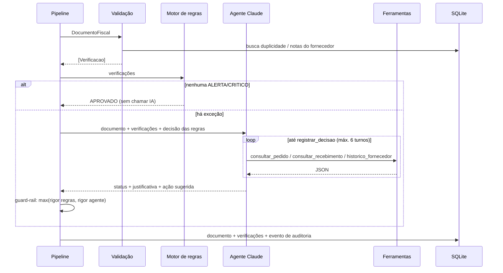
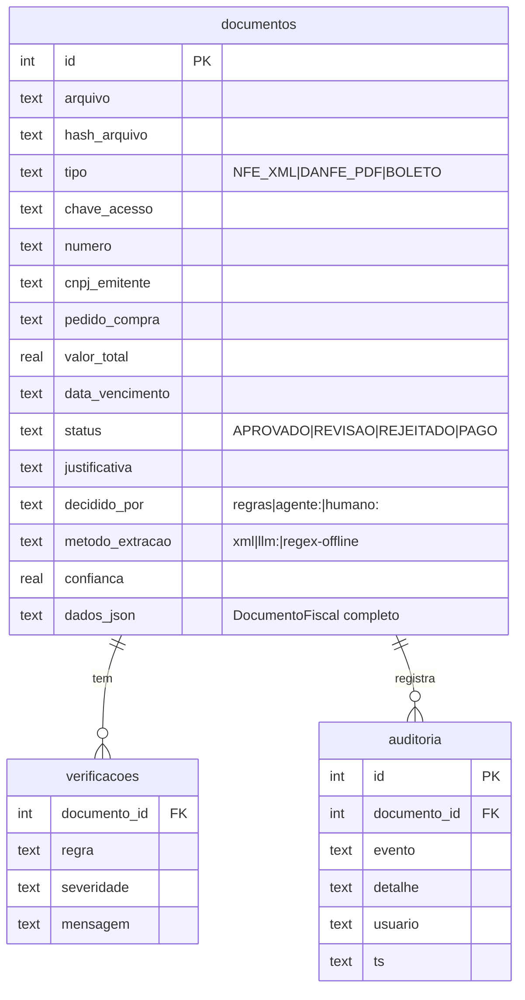

# Arquitetura técnica: Agente de Contas a Pagar

## 1. Componentes

| Camada | Módulo | Responsabilidade | Usa IA? |
|---|---|---|---|
| Ingestão | `ingest_email.py`, `pipeline.py` | Baixa anexos XML/PDF de e-mails não lidos (IMAP); lista a inbox; notas antes de boletos | Não |
| Provedores de IA | `llm.py` | Claude (PDF nativo + structured outputs) ou API compatível com OpenAI (OpenRouter/Qwen, Ollama) | Sim |
| Extração XML | `extract/nfe_xml.py` | Lê NF-e 4.00 (`infNFe`, `det/prod`, `ICMSTot`, `cobr/dup`, `xPed`) | Não |
| Extração PDF | `extract/pdf_documento.py` | DANFE/boleto → `ExtracaoLLM` pelo provedor configurado; falhou → regex | Sim |
| Dados mestres | `cadastros.py` | Fornecedores, pedidos, recebimentos | Não |
| Validação | `validacao.py` | 21 regras com severidade OK/ALERTA/CRITICO | Não |
| Decisão | `agente.py` | Regras + agente com ferramentas + guard-rail | Sim (só exceções) |
| Persistência | `store.py` | SQLite: `documentos`, `verificacoes`, `auditoria` | Não |
| Interfaces | `__main__.py`, `dashboard.py`, `mcp_server.py` | CLI, painel, MCP | — |

## 2. Fluxo de decisão

## 3. Catálogo de regras (`validacao.py`)

| Regra | Severidade se falhar | Aplica a |
|---|---|---|
| `cnpj_emitente`: DV do CNPJ | CRITICO | todos |
| `fornecedor_cadastrado` | CRITICO | todos |
| `destinatario` é a nossa empresa | CRITICO | todos |
| `duplicidade`: chave, emitente+número ou hash | CRITICO | todos |
| `chave_acesso`: DV mod 11 | CRITICO | NF-e/DANFE |
| `soma_itens` = valor dos produtos | CRITICO | NF-e/DANFE |
| `calculo_item`: qtd × unitário = total | ALERTA | NF-e/DANFE |
| `confianca_extracao` < 85% | ALERTA | PDF |
| `pedido` existe / referenciado | CRITICO / ALERTA | NF-e/DANFE |
| `pedido_inferido`: nota sem pedido, mas um único pedido do fornecedor contém todos os itens | OK (informativo) | NF-e/DANFE |
| `pedido_fornecedor`: pedido é do emitente | CRITICO | NF-e/DANFE |
| `preco`: unitário acima da tolerância (2%) | ALERTA | NF-e/DANFE |
| `quantidade_pedido`: faturado > pedido | ALERTA | NF-e/DANFE |
| `recebimento`: faturado > recebido | ALERTA | NF-e/DANFE |
| `fraude_beneficiario`: nome de fornecedor com outro CNPJ | CRITICO | boleto |
| `linha_digitavel`: DVs mod 10/11 | CRITICO | boleto |
| `valor_codigo_barras` = valor impresso | CRITICO | boleto |
| `boleto_x_nota`: existe NF de lastro | ALERTA / CRITICO | boleto |
| `vencimento`: vencido / sem data | ALERTA | todos |
| `vencimento_calculado`: sem duplicata, usa `prazo_pagamento_dias` do fornecedor | OK (informativo) | NF-e/DANFE |
| `vencimento_proximo` ≤ 3 dias | OK (prioridade) | todos |

## 4. Modelo de dados (SQLite)

A tabela `auditoria` é só de inserção: toda decisão (regra, agente ou humano) gera um evento com autor e horário.

## 5. Uso da IA (`llm.py`)

A IA é intercambiável. `llm.provedor_do_processo()` devolve o provedor configurado, e o resto do sistema não
sabe qual modelo está do outro lado. Com uma chave de reserva, ele devolve uma `ProvedorEmCadeia`: principal
primeiro, depois cada modelo da reserva, com um disjuntor que pula até o fim do lote os modelos com cota
esgotada. Qualquer falha devolve o controle ao modo offline:
regex na extração e regras na decisão. O processo nunca para por causa da IA.

| | Claude (`anthropic`) | API compatível com OpenAI (`openai_compat`) |
|---|---|---|
| Exemplos | Haiku 4.5 (extração), Sonnet 5.5 (reextração e agente) | OpenRouter (validado com `nvidia/nemotron-3-super-120b-a12b:free`), Gemini (validado com `gemini-3.5-flash` e `-lite`), Ollama local |
| Entrada do PDF | Bloco `document` (base64), lê inclusive escaneado | Texto extraído com `pypdf` (não lê PDF escaneado) |
| Formato da resposta | Structured outputs (`client.messages.parse` + schema Pydantic `ExtracaoLLM`) | `response_format` JSON Schema; se recusado, `json_object`; validação Pydantic |
| Confiança baixa (< 0,85) | Reextrai com o modelo maior | Vai para revisão |
| Ferramentas do agente | `tools` Anthropic com `strict: true` | As mesmas 4, convertidas para `tools` / `tool_calls` |
| Erros tratados | `anthropic.APIError` | `openai.OpenAIError` (ex.: 429 por limite do plano gratuito) |

**Agente** (`agente.py`):
- Loop de tool use com 4 ferramentas (`consultar_pedido`, `consultar_recebimento`,
  `historico_fornecedor`, `registrar_decisao`), até 6 turnos.
- `tool_choice` automático, com a instrução de finalizar sempre via `registrar_decisao`.
- Só roda em exceções: documento limpo é aprovado pelas regras, sem gastar tokens.
- Guard-rail: vale a decisão mais restritiva entre regras e agente.

## 5.1 Ingestão por e-mail (`ingest_email.py`)

- IMAP com SSL e senha de app. Busca mensagens `UNSEEN` e lê com `BODY.PEEK`, sem marcar.
- Salva só `.xml` e `.pdf` de até 10 MB, com nome sanitizado e prefixo do UID (`email7_nota.xml`).
- Marca a mensagem como lida depois de salvar; nunca apaga. Audita `EMAIL_RECEBIDO`.
- `pipeline.processar_emails()` atende à CLI (`ler-email`), ao painel (Buscar e-mails) e ao MCP (`buscar_emails`).

## 6. Runbook

| Sintoma | Causa provável | Ação |
|---|---|---|
| Todos os PDFs vão para REVISAO | Sem chave de IA (modo offline) | Configurar `AP_LLM_PROVEDOR` e a chave no `.env` |
| Log "Modelo ... indisponível (Error code: 429)" | Limite do modelo gratuito atingido | Aguardar, trocar `AP_LLM_MODELO` por outro gratuito ou usar provedor pago; enquanto isso, as regras decidem |
| `ler-email` responde "E-mail não configurado" | `AP_EMAIL_USUARIO` / `AP_EMAIL_SENHA` vazios | Preencher o `.env` (senha de app, não a senha da conta) |
| Erro de login IMAP (`AUTHENTICATIONFAILED`) | Senha de app errada ou verificação em duas etapas desativada | Gerar nova senha de app |
| Arquivo com status ERRO e evento `EXTRACAO_FALHOU` | XML que não é NF-e (ex.: NFS-e de serviço) ou arquivo corrompido | Lançar manualmente; NFS-e está prevista para a fase 2 |
| `decidido_por = regras` em exceções, log "Agente indisponível" | Erro/limite da API | Ver log; o processamento seguiu pelas regras |
| Nota legítima REJEITADA por `fornecedor_cadastrado` | Fornecedor novo não cadastrado no ERP | Cadastrar e reprocessar (o registro rejeitado não bloqueia o reprocessamento) |
| Boleto REJEITADO por `boleto_x_nota` | Boleto chegou antes da nota | Processar a nota; reenviar o boleto |
| `database is locked` | Painel e lote escrevendo ao mesmo tempo | Em produção trocar SQLite por PostgreSQL |
