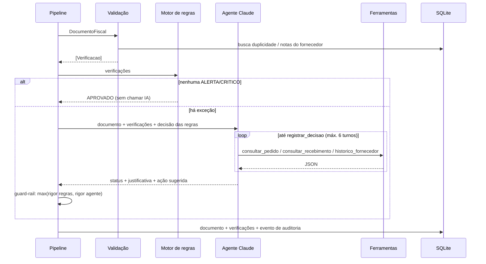
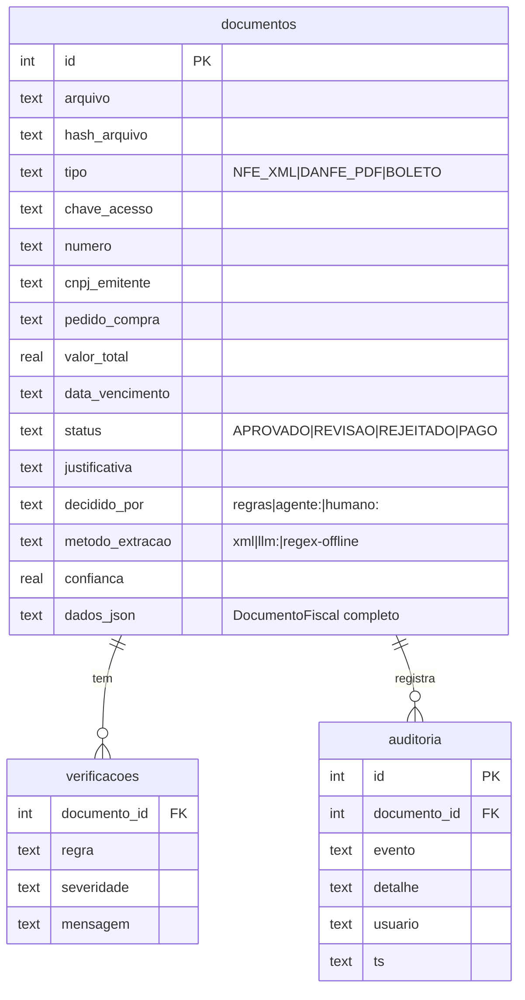

# Arquitetura técnica: Agente de Contas a Pagar

## 1. Componentes

| Camada | Módulo | Responsabilidade | Usa IA? |
|---|---|---|---|
| Ingestão | `pipeline.py` | Lista XML/PDF da inbox; notas antes de boletos | Não |
| Extração XML | `extract/nfe_xml.py` | Lê NF-e 4.00 (`infNFe`, `det/prod`, `ICMSTot`, `cobr/dup`, `xPed`) | Não |
| Extração PDF | `extract/pdf_documento.py` | DANFE/boleto → `ExtracaoLLM` via `client.messages.parse` | Sim (Haiku → Sonnet) |
| Dados mestres | `cadastros.py` | Fornecedores, pedidos, recebimentos | Não |
| Validação | `validacao.py` | 15 regras com severidade OK/ALERTA/CRITICO | Não |
| Decisão | `agente.py` | Regras + agente com ferramentas + guard-rail | Sim (só exceções) |
| Persistência | `store.py` | SQLite: `documentos`, `verificacoes`, `auditoria` | Não |
| Interfaces | `__main__.py`, `dashboard.py`, `mcp_server.py` | CLI, painel, MCP | — |

## 2. Fluxo de decisão

## 3. Catálogo de regras (`validacao.py`)

| Regra | Severidade se falhar | Aplica a |
|---|---|---|
| `cnpj_emitente`: DV do CNPJ | CRITICO | todos |
| `fornecedor_cadastrado` | CRITICO | todos |
| `destinatario` é a nossa empresa | CRITICO | todos |
| `duplicidade`: chave, emitente+número ou hash | CRITICO | todos |
| `chave_acesso`: DV mod 11 | CRITICO | NF-e/DANFE |
| `soma_itens` = valor dos produtos | CRITICO | NF-e/DANFE |
| `calculo_item`: qtd × unitário = total | ALERTA | NF-e/DANFE |
| `confianca_extracao` < 85% | ALERTA | PDF |
| `pedido` existe / referenciado | CRITICO / ALERTA | NF-e/DANFE |
| `pedido_fornecedor`: pedido é do emitente | CRITICO | NF-e/DANFE |
| `preco`: unitário acima da tolerância (2%) | ALERTA | NF-e/DANFE |
| `quantidade_pedido`: faturado > pedido | ALERTA | NF-e/DANFE |
| `recebimento`: faturado > recebido | ALERTA | NF-e/DANFE |
| `fraude_beneficiario`: nome de fornecedor com outro CNPJ | CRITICO | boleto |
| `linha_digitavel`: DVs mod 10/11 | CRITICO | boleto |
| `valor_codigo_barras` = valor impresso | CRITICO | boleto |
| `boleto_x_nota`: existe NF de lastro | ALERTA / CRITICO | boleto |
| `vencimento`: vencido / sem data | ALERTA | todos |
| `vencimento_proximo` ≤ 3 dias | OK (prioridade) | todos |

## 4. Modelo de dados (SQLite)

A tabela `auditoria` é só de inserção: toda decisão (regra, agente ou humano) gera um evento com autor e horário.

## 5. Uso da Claude API

**Extração de PDF** (`pdf_documento.py`):
- O PDF vai como bloco `document` (base64) e a resposta é validada pelo schema Pydantic `ExtracaoLLM`
  (structured outputs via `client.messages.parse`). Não há parsing frágil de texto livre.
- O schema inclui `confianca` (0–1). Abaixo de `AP_CONFIANCA_MINIMA` (0.85), o documento é reextraído com o
  modelo mais forte. Se continuar baixa, a regra `confianca_extracao` manda para revisão.

**Agente** (`agente.py`):
- Loop manual de tool use com 4 ferramentas `strict` (`consultar_pedido`, `consultar_recebimento`,
  `historico_fornecedor`, `registrar_decisao`).
- `tool_choice` automático, com a instrução de finalizar sempre via `registrar_decisao`. Os modelos atuais
  não aceitam `tool_choice` forçado.
- O histórico mantém `resp.content` completo, incluindo blocos de thinking.
- Se a API falhar (`anthropic.APIError`), a decisão cai para o motor de regras. O processo nunca para por
  causa da IA.

## 6. Runbook

| Sintoma | Causa provável | Ação |
|---|---|---|
| Todos os PDFs vão para REVISAO | Sem `ANTHROPIC_API_KEY` (modo offline) | Configurar `.env` |
| `decidido_por = regras` em exceções, log "Agente indisponível" | Erro/limite da API | Ver log; o processamento seguiu pelas regras |
| Nota legítima REJEITADA por `fornecedor_cadastrado` | Fornecedor novo não cadastrado no ERP | Cadastrar e reprocessar (o registro rejeitado não bloqueia o reprocessamento) |
| Boleto REJEITADO por `boleto_x_nota` | Boleto chegou antes da nota | Processar a nota; reenviar o boleto |
| `database is locked` | Painel e lote escrevendo ao mesmo tempo | Em produção trocar SQLite por PostgreSQL |
