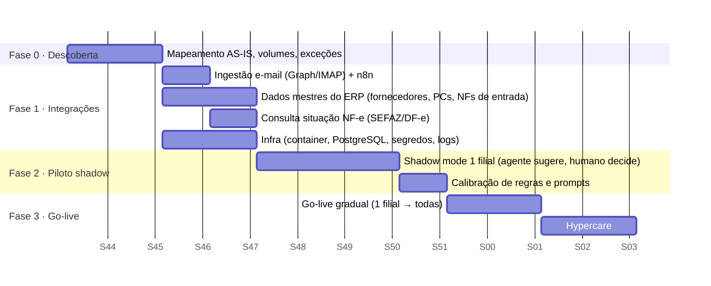
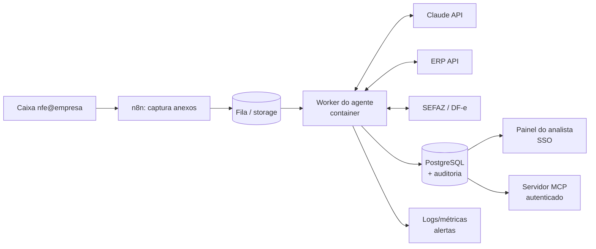

# Plano de implantação em produção: Agente de Contas a Pagar

> Premissas usadas nas estimativas (ajustar com dados reais na fase de descoberta): indústria de porte
> médio, **2.000 documentos/mês** (70% NF-e com XML, 30% só PDF), **3 analistas** de contas a pagar,
> custo de **R$ 45/h** por analista com encargos, **6 min** de trabalho manual por documento.

## 1. Objetivo e escopo

Levar o agente do protótipo para operação real, integrado ao e-mail corporativo, ao ERP e à SEFAZ, com
governança, segurança e métricas de resultado.

- **Dentro do escopo:** NF-e de produtos (modelo 55), DANFE em PDF, boletos, 3-way match, fila de revisão,
  aprovação auditada e exportação/lançamento no ERP.
- **Fora (fase 2):** NFS-e municipal (layouts variados), CT-e, conciliação bancária, pagamento automático.

## 2. Cronograma (10 semanas)

| Fase | Entregas | Critério para avançar |
|---|---|---|
| **0. Descoberta** (sem. 1–2) | Fluxo AS-IS, amostra de 300 documentos reais anonimizados, catálogo de exceções, baseline de tempo/erros | Baseline medido e aprovado pelo gestor financeiro |
| **1. Integrações** (sem. 3–4) | Conectores de e-mail, ERP (leitura) e SEFAZ; infraestrutura; SSO no painel | Testes de integração verdes em homologação |
| **2. Piloto shadow** (sem. 5–8) | Agente processa tudo em paralelo ao time e compara | ≥ 98% de concordância nas aprovações automáticas e **0 falso-aprovado** em casos críticos |
| **3. Go-live** (sem. 9–10, +2 hypercare) | Liga a escrita no ERP (pré-lançamento), treinamento, runbook | KPIs estáveis por 2 semanas |

### Cronograma de integrações

| Integração | Como | Esforço | Risco |
|---|---|---|---|
| E-mail corporativo | Leitura por IMAP já existe no protótipo (`ingest_email.py`); em produção, trocar a senha de app por OAuth (Microsoft Graph ou Gmail API) | 2 dias | Baixo |
| ERP: leitura de cadastros/pedidos/recebimentos | API REST do ERP (TOTVS/SAP/Omie) ou view read-only no banco; substitui `cadastros.py` | 5–8 dias | **Médio:** depende da TI/fornecedor do ERP |
| ERP: escrita do pré-lançamento | API do ERP; só documentos APROVADOS; idempotente pela chave de acesso | 5 dias | Médio |
| SEFAZ: situação da NF-e / manifestação | Web service de consulta (certificado A1) ou provedor de DF-e | 3 dias | Médio: certificado digital |
| Claude API | SDK já integrado; conta corporativa, limites e alertas de gasto | 1 dia | Baixo |
| MCP | Servidor MCP por HTTP com autenticação, para Claude Desktop/Code dos analistas e para o n8n | 2 dias | Baixo |

## 3. Arquitetura de produção

Mudanças em relação ao protótipo: SQLite → PostgreSQL; pasta → fila com retry; segredos em cofre;
painel com SSO; logs estruturados com custo de tokens por documento.

## 4. Custos

### 4.1 Claude API (variável)

| Item | Volume/mês | Tokens por doc (estimado) | Custo por doc | Custo/mês |
|---|---|---|---|---|
| Extração de PDF (Haiku 4.5: $1 in / $5 out por MTok) | 600 PDFs | ~3k in / ~0,6k out | ~US$ 0,006 | ~US$ 4 |
| Reextração Sonnet 5.5 (~10% dos PDFs) | 60 | ~3k in / ~1k out | ~US$ 0,016 | ~US$ 1 |
| Agente em exceções (Sonnet 5.5: $2 / $10) | ~500 (25%) | ~12k in / ~2k out (3–4 turnos) | ~US$ 0,044 | ~US$ 22 |
| **Total API** | | | | **≈ US$ 27/mês (≈ R$ 150)** |

Alavancas, se o volume crescer: *prompt caching* do system prompt e das ferramentas do agente; Batch API
(50% de desconto) para lotes noturnos; reduzir o esforço do agente para `low` em exceções simples.

**Alternativas de provedor.** O código aceita qualquer API compatível com OpenAI (`AP_LLM_PROVEDOR`), então o
custo de IA pode ser ajustado a cada fase:

| Fase | Opção | Custo de IA | Observação |
|---|---|---|---|
| Prova de conceito / demo | Modelo gratuito no OpenRouter (validado: Nemotron 3 Super) | R$ 0 | Limite diário e indisponibilidade ocasional (erro 429); só dados fictícios, pois o plano gratuito pode usar os dados |
| Piloto shadow e produção | Claude (tabela acima) | ≈ US$ 27/mês | Contrato de dados (LGPD), lê PDF escaneado, alta disponibilidade |
| Alternativa com dados sensíveis | Modelo aberto local (Ollama) em servidor próprio | Só infraestrutura (servidor com memória e, idealmente, GPU; dimensionar no piloto) | Dados não saem da empresa; qualidade e velocidade menores |

### 4.2 Infraestrutura e ferramentas (recorrente)

| Item | Custo/mês estimado |
|---|---|
| VM/container (2 vCPU, 4 GB) + PostgreSQL gerenciado | R$ 300–500 |
| n8n self-hosted (no mesmo servidor) | R$ 0 (licença community) |
| Certificado digital A1 (para SEFAZ) | ~R$ 20 (R$ 250/ano) |
| Monitoramento/logs | R$ 0–150 |
| **Total recorrente** | **≈ R$ 500–800/mês** (incluindo API) |

### 4.3 Implantação (único)

| Item | Estimativa |
|---|---|
| Desenvolvimento e integrações (~240 h de dev/RPA) | conforme custo interno |
| Horas do time financeiro (descoberta, shadow, treinamento: ~60 h) | ~R$ 2.700 |
| Apoio da TI/fornecedor do ERP (APIs, credenciais) | variável, principal incerteza |

### 4.4 Retorno

| | Hoje | Com o agente |
|---|---|---|
| Tempo de digitação/conferência | 2.000 × 6 min = **200 h/mês** | ~25% exceções × 3 min = **25 h/mês** |
| Custo de mão de obra nessa tarefa | **R$ 9.000/mês** | **R$ 1.125/mês** |
| Custo de operação do agente | — | ~R$ 800/mês |
| **Economia líquida** | | **≈ R$ 7.000/mês (≈ 175 h liberadas)** |

Fora da conta acima, e geralmente maior: **pagamentos em duplicidade evitados**, **golpes de boleto
barrados**, **multas e juros evitados** e **descontos por antecipação** capturados. Um único boleto
fraudado barrado costuma pagar o projeto.

**Payback** estimado: 1 a 3 meses após o go-live, conforme o custo de desenvolvimento considerado.

## 5. Riscos e mitigação

| # | Risco | Prob. | Impacto | Mitigação |
|---|---|---|---|---|
| 1 | IA extrai um campo errado de um PDF | Média | Alto | Validações determinísticas independentes (somas, DV, match com pedido); confiança + reextração; guard-rail (IA não aprova o que regra bloqueia); XML sempre preferido ao PDF |
| 2 | Aprovação indevida (falso-aprovado) | Baixa | Alto | Shadow mode com meta de 0 falso-aprovado; go-live escreve só *pré-lançamento* no ERP; pagamento continua com alçada humana |
| 3 | Atraso da integração com o ERP | **Alta** | Médio | Começar pela leitura (view/CSV export agendado como plano B); camada `cadastros.py` isolada |
| 4 | LGPD e sigilo fiscal (dados enviados à API) | Média | Alto | Só PDFs sem XML vão à IA; contrato/DPA com o provedor; retenção mínima; mascarar dados pessoais de PF; logs sem conteúdo do documento |
| 5 | Indisponibilidade ou limite da Claude API | Baixa | Médio | Fila com retry; fallback automático para regras + revisão humana; alertas de gasto |
| 6 | Resistência do time / medo de substituição | Média | Médio | Envolver analistas desde a descoberta; posicionar como "fim da digitação"; painel pensado para eles |
| 7 | Mudanças de layout (DANFE de fornecedor novo, NT da SEFAZ) | Média | Baixo | XML é padronizado; extração por IA não depende de template; monitorar % de revisão por fornecedor |
| 8 | Fornecedor sem pedido de compra (compras emergenciais) | Alta | Baixo | Cai em REVISAO; relatório de compras sem PC alimenta melhoria de processo |
| 9 | Fraudes mais sofisticadas (e-mail falso com boleto válido) | Baixa | Alto | Regra de beneficiário × cadastro; alerta de mudança de dados bancários; dupla checagem fora do e-mail |

## 6. KPIs

| KPI | Baseline (estimado) | Meta 90 dias |
|---|---|---|
| Tempo médio de entrada por documento | 6 min | < 1 min (automático) / 3 min (exceção) |
| % *straight-through* (sem toque humano) | 0% | ≥ 70% |
| Concordância agente × analista no shadow | — | ≥ 98% |
| Falso-aprovado | — | 0 |
| Duplicidades pagas | medir | 0 |
| Multas/juros por atraso | medir | −80% |
| Custo de API por documento | — | < US$ 0,02 |

## 7. Governança

| Papel | Responsável | Consultado | Informado |
|---|---|---|---|
| Regras de validação e tolerâncias | Gestor financeiro | Controladoria | Analistas |
| Operação diária / fila de revisão | Analistas AP | — | Gestor |
| Integrações, infra e segurança | TI / time de RPA | Fornecedor do ERP | Gestor |
| Prompts, modelos e custo de IA | Time de RPA | Gestor financeiro | TI |

- **Mudança de regra:** pull request + teste automatizado + aprovação do gestor financeiro.
- **Mudança de prompt ou modelo:** reavaliar contra o conjunto de documentos do shadow antes de subir.
- **Monitoramento:** alerta se a % de REVISAO subir > 10 p.p. num dia, se o custo de API diário passar do
  limite ou se houver falha de integração.
- **Revisão mensal:** amostra de 30 aprovações automáticas auditada pela controladoria.

## 8. Próximos passos (fase 2)

1. NFS-e (serviços) via padrão nacional.
2. Conciliação: baixa automática quando o pagamento aparece no extrato (OFX/API bancária).
3. Previsão de caixa: alimentar o fluxo de caixa com vencimentos aprovados.
4. Conversa com fornecedores: o agente redige e envia (com aprovação) pedidos de carta de correção.
