# Post automático no TikTok com n8n e IA

Fluxo low-code no **n8n** que cria e publica sozinho vídeos curtos no TikTok:

1. escolhe o tema: agendado, por formulário ou por pedido em linguagem natural via **MCP**;
2. a **IA** escreve o roteiro (gancho, cenas, narração, CTA, hashtags, um emoji e palavras-chave de foto
   por cena). A cadeia de IA gratuita tenta OpenRouter, depois Gemini, depois Gemini Lite, e por fim um banco
   de roteiros. O Claude também pode ser usado;
3. gera o **vídeo 9:16** com foto de fundo por cena (Pixabay ou Pexels), emoji, legendas dinâmicas palavra a
   palavra, narração neural pt-BR, trilha original e transições em crossfade (H.264/AAC);
4. manda a prévia no **Telegram** e espera **Publicar** ou **Descartar** (aprovação humana);
5. publica pela **TikTok Content Posting API** oficial (Direct Post), acompanha o processamento e registra
   tudo num log. Erros caem num workflow de tratamento, com mensagem clara.

**Publicação real validada em 06/10/2026:** 4 vídeos chegaram a `PUBLISH_COMPLETE` na conta de teste do
sandbox, todos aprovados pelo Telegram. O primeiro foi `v_pub_file~v2-1.7693659920302147605`; o último,
com roteiro do Gemini e o visual completo, foi `v_pub_file~v2-1.7693674964672235540`. Detalhes em
[Testes realizados](#testes-realizados).

Inspirado no vídeo de referência ("This n8n AI Agent will AUTOMATE your Social Media"). As melhorias estão
em [Diferenciais](#diferenciais).


Vídeo publicado pelo fluxo, com roteiro escrito pelo Gemini:
[`assets/exemplo_visual_gemini.mp4`](assets/exemplo_visual_gemini.mp4) (`publish_id v_pub_file~v2-1.7693674964672235540`).
A primeira versão, mais simples, está em [`assets/exemplo_golpe_do_boleto.mp4`](assets/exemplo_golpe_do_boleto.mp4).

## Arquitetura

```mermaid
flowchart LR
    subgraph Gatilhos
      A1[Agendado 11h]
      A2[Formulário]
      A3[MCP: criar_post_tiktok<br/>Claude Code/Desktop]
      A4[Testar agora]
    end
    A1 & A2 & A3 & A4 --> C[Config]
    C --> D{usar_ia?}
    D -- sim --> P{provedor}
    P -- openrouter --> E1[OpenRouter<br/>modelo gratuito]
    P -- anthropic --> E2[Claude API]
    E1 -- erro/limite --> E3[Gemini Flash<br/>reserva gratuita]
    E3 -- erro/503 --> E4[Gemini Flash-Lite<br/>segunda tentativa]
    D -- não --> F[Banco de roteiros]
    E2 & E4 -- erro --> F
    E1 & E2 & E3 & E4 --> G[Normalizar roteiro]
    F --> G
    G --> H[Serviço de mídia<br/>fotos + emoji + legendas<br/>+ trilha + crossfade]
    H --> I{exigir_aprovacao?}
    I -- sim --> J[Telegram: prévia<br/>+ Publicar/Descartar]
    J -- Publicar --> K
    I -- não --> K[Subworkflow: token válido<br/>OAuth + refresh]
    K --> L[creator_info/query]
    L --> M[video/init FILE_UPLOAD<br/>+ conferir resposta]
    M --> N[PUT upload_url]
    N --> O[Wait 5s → status/fetch<br/>loop até PUBLISH_COMPLETE]
    O --> R[Log + resultado]
    M & O -- recusa/FAILED --> X[Erro claro → workflow de erros]
```



### Workflows (`workflows/`)

| Arquivo | O que faz |
|---|---|
| `01_tiktok_post_automatico.json` | Fluxo principal (38 nós): gatilhos, roteiro (cadeia de IA ou banco), vídeo, aprovação, publicação, log |
| `02_tiktok_autenticacao.json` | OAuth do TikTok: `GET /webhook/tiktok/login` (redireciona), `GET /webhook/tiktok/callback` (troca `code` por token, valida `state`) e subworkflow que entrega um `access_token` válido, renovando com `refresh_token` |
| `03_tiktok_erros.json` | *Error Trigger*: registra a falha, o nó e o link da execução |
| `04_tiktok_mcp_server.json` | **Servidor MCP** em `/mcp/tiktok` com `criar_post_tiktok(tema)` e `historico_publicacoes()` |

Os JSONs são gerados por `workflows/src/build.py` (fluxo como código). Os do repositório são **genéricos e sem
segredos**. A configuração local (ids de credenciais, app TikTok, Telegram) fica em `workflows/src/local.json`,
fora do git, e é aplicada por `scripts/configurar.py`.

### Serviço de mídia (`media_service/`)

Pequeno serviço HTTP local (Python stdlib) que o n8n chama via *HTTP Request*:

| Rota | Função |
|---|---|
| `POST /render` | Roteiro → `video.mp4` 1080×1920 + capa (detalhes em [Como o vídeo é montado](#como-o-vídeo-é-montado)) |
| `GET/POST /tokens` | Guarda os tokens OAuth em arquivo local fora do git |
| `GET/POST /log` | Histórico de publicações (CSV) |
| `/mock-tiktok/...` | **Simulador da Content Posting API**: mesmos endpoints e contratos, inclusive a regra de conta privada (`MOCK_CONTA_PRIVADA=0` reproduz a recusa) |

Por que um serviço em vez do nó *Execute Command*: o n8n 2.x bloqueia esse nó por padrão. Com HTTP, o mesmo
desenho funciona com n8n em Docker ou na nuvem.

## Como rodar

Pré-requisitos: Python 3.10+, ffmpeg no PATH e **Node 24** (exigido pelo n8n 2.x), que pode ser portátil:

```powershell
# Node 24 portátil + n8n local (uma vez)
# baixe https://nodejs.org/dist/latest-v24.x/node-v24.*-win-x64.zip e extraia em $HOME\tools\node24
$env:PATH = "$HOME\tools\node24;$env:PATH"
mkdir $HOME\tools\n8n; cd $HOME\tools\n8n; npm init -y; npm install n8n

cd <repo>\desafio2-tiktok-n8n
pip install -r requirements.txt
.\importar.ps1          # importa os 4 workflows (n8n parado)
.\iniciar.ps1           # sobe serviço de mídia (porta 8765) + n8n (porta 5678)
```

No n8n (<http://localhost:5678>), clique em **Publish** nos 4 workflows.

### Modo simulador (sem nenhuma conta)
1. Conecte a conta simulada abrindo
   `http://localhost:5678/webhook/tiktok/callback?code=teste&state=case-gogroup-csrf`.
2. Publique pelo botão *Execute workflow*, pelo formulário ou com `python scripts/testar_mcp.py "tema"`.

Sem credenciais, o roteiro vem do banco e não há aprovação. O fluxo publica no simulador.

### Modo completo (TikTok real, IA e Telegram)
Copie `.env.example` para `.env`, preencha as chaves e siga [docs/setup-tiktok.md](docs/setup-tiktok.md):
app no sandbox do TikTok, conta de teste **privada**, bot do Telegram e túnel HTTPS para o login. Chaves
gratuitas opcionais: Gemini (<https://aistudio.google.com/apikey>), para a reserva de IA, e Pixabay
(<https://pixabay.com/api/docs/>), para as fotos de fundo. Depois:

```powershell
python scripts\configurar.py      # cria credenciais no n8n e aplica a configuração (sem imprimir segredos)
```

### Como o vídeo é montado

| Recurso | Como | Sem rede ou sem chave |
|---|---|---|
| Foto de fundo por cena | Busca no **Pixabay** ou **Pexels** pelas palavras-chave que a IA escolheu; recorte 9:16, escurecimento no topo e na base para legibilidade, leve tom da marca. Licença livre, sem atribuição obrigatória | Degradê |
| Emoji da cena | Fonte Segoe UI Emoji colorida, num selo circular sobre a foto | Sempre disponível (offline) |
| Texto principal | Painel translúcido com sombra, tamanho ajustado ao comprimento | — |
| Narração | **edge-tts**, voz neural `pt-BR-AntonioNeural`, com o tempo de cada palavra | Cena muda |
| Legendas dinâmicas | Arquivo ASS gerado a partir dos tempos das palavras: até 3 por vez, quebra na pontuação, palavra falada em amarelo | Tempos estimados |
| Trilha | Composição original gerada com numpy (progressão vi–IV–I–V, 96 BPM, pad + arpejo), sem direitos autorais; abaixa sozinha sob a fala (sidechain) | Sempre disponível |
| Transições | Crossfade de vídeo (xfade) e de áudio (acrossfade) entre as cenas; zoom lento em cada cena | — |

### Painel de controle (nó **Config**)

| Campo | Padrão | Efeito |
|---|---|---|
| `usar_ia` | `true` | Gera o roteiro com IA; sem credencial ou com falha, usa o banco de roteiros |
| `provedor_ia` | `openrouter` | `openrouter` (modelo gratuito) ou `anthropic` (Claude, exige credencial Anthropic) |
| `modelo_openrouter` | `nvidia/nemotron-3-super-120b-a12b:free` | Modelo gratuito usado no OpenRouter |
| `modelo_gemini` / `modelo_gemini_lite` | escolhidos pelo `configurar.py` | Reserva: o Flash que respondeu mais rápido e o Flash-Lite |
| `exigir_aprovacao` | `false` (ligado pelo `configurar.py` quando há bot) | Envia a prévia ao Telegram e espera a decisão |
| `privacidade_preferida` | `SELF_ONLY` | Usada se estiver entre as opções retornadas por `creator_info` |
| `marca` | `@automacao.na.pratica` | Handle exibido no vídeo |

A troca **simulador ↔ API real** é um campo: `TIKTOK_MODO` no `.env` (vira `api_base` no workflow de
autenticação).

## Integração MCP

Com o workflow `TikTok · Servidor MCP` publicado, qualquer cliente MCP cria posts em linguagem natural:

```bash
claude mcp add --transport http tiktok-n8n http://localhost:5678/mcp/tiktok
# no Claude Code: "publica um vídeo sobre golpe do boleto e me mostra o histórico"
```

Com a aprovação ligada, a ferramenta responde que o fluxo está esperando a decisão humana, e o post segue
sozinho quando alguém toca em **Publicar** no Telegram.

## Testes realizados

Ambiente: n8n 2.41.7 local, Node 24.21.

| Cenário | Modo | Resultado |
|---|---|---|
| **Post real com aprovação** | TikTok real (sandbox) + Telegram | Prévia no Telegram → **Publicar** → `PUBLISH_COMPLETE`, `modo: api-real`, `SELF_ONLY`, vídeo no perfil da conta de teste |
| Conta de teste pública | TikTok real | API recusou com `unaudited_client_can_only_post_to_private_accounts`; após deixar a conta privada, publicou. O fluxo agora traduz esse erro em instrução |
| OAuth real | TikTok real + túnel | Login → autorização → token (24 h) e refresh token (365 dias), escopos `user.info.basic,video.publish` |
| Ponta a ponta via MCP | Simulador | `PUBLISH_COMPLETE`, 845.748 bytes enviados por PUT e conferidos |
| OAuth: `state` inválido | Simulador | HTTP 400 "Callback inválido" (proteção CSRF) |
| Renovação de token | Simulador | Token vencido renovado pelo refresh token; post concluído |
| Conta desconectada | Simulador | Erro claro; workflow de erros registrou nó, mensagem e link |
| **IA reserva** | OpenRouter sem cota (429) → Gemini | Roteiro escrito por `gemini-3.5-flash` para um tema fora do banco ("previsão de fluxo de caixa"), com emoji e fotos por cena; post real publicado |
| **Visual novo em post real** | TikTok real | Vídeo com fotos do Pixabay, emojis, legendas dinâmicas, trilha e crossfade: `PUBLISH_COMPLETE` |
| Gemini sobrecarregado | Gemini (HTTP 503) | Diagnosticado; criada a segunda tentativa com Flash-Lite e a escolha do modelo pela latência medida |
| IA indisponível | OpenRouter (limite diário gratuito atingido, erro 429) | Banco de roteiros assumiu; post publicado mesmo assim |
| IA sem credencial | Claude | Nó falhou e caiu no banco; post publicado |

Log de exemplo: [`assets/exemplo_log_publicacoes.csv`](assets/exemplo_log_publicacoes.csv).

## Diferenciais

| Vídeo de referência | Este fluxo |
|---|---|
| Publica direto | Aprovação humana pelo Telegram (*send-and-wait*), testada com post real |
| Depende 100% da IA | *Fallback* para banco de roteiros se a IA falhar, recusar ou atingir limite |
| IA paga | Cadeia de IA gratuita (OpenRouter → Gemini → Gemini Lite → banco); Claude como opção |
| Vídeo simples | Fotos por cena, emoji, legendas dinâmicas palavra a palavra, trilha original e crossfade |
| Saída de IA em texto livre | *Structured output* com JSON Schema: sem parsing frágil |
| Ferramentas pagas de vídeo | Vídeo montado localmente, custo zero (TTS neural gratuito + ffmpeg) |
| — | Respeita as regras da API: `creator_info` antes de postar, `is_aigc=true`, polling de status |
| — | OAuth completo com `state` anti-CSRF e renovação automática do token |
| — | Erros traduzidos em ação (ex.: "deixe a conta privada"), workflow de erros e log |
| — | Servidor MCP: publicar conversando com o Claude |
| — | Simulador da API para testar sem conta; segredos fora do git |

## Custos

| Item | Custo |
|---|---|
| n8n self-hosted, edge-tts, ffmpeg, TikTok API, Telegram, túnel Cloudflare | R$ 0 |
| Roteiro por IA no OpenRouter (modelo gratuito) | R$ 0 (limite de 50 chamadas/dia sem créditos) |
| Reserva Gemini (Google AI Studio, plano gratuito) e fotos (Pixabay/Pexels) | R$ 0 |
| Opcional: Claude no lugar do modelo gratuito | ≈ US$ 0,03 por vídeo; 30 vídeos/mês ≈ US$ 1 |
| Opcional: servidor para rodar 24 h | US$ 0–10/mês |

## Limitações

- **App sem auditoria (sandbox):** só publica em conta **privada**, e os vídeos ficam visíveis só para o dono.
  Posts públicos exigem a auditoria do app pelo TikTok.
- **Modelos gratuitos:** 50 chamadas/dia no OpenRouter sem créditos e disponibilidade variável no Gemini
  (HTTP 503 em horários de pico). A cadeia de reservas e o banco de roteiros garantem o post.
- **Fotos:** dependem de chave do Pixabay ou do Pexels (o Pexels suspendeu temporariamente novas chaves em
  10/2026). Sem chave, o fundo é degradê.
- **Túnel rápido:** a URL muda a cada execução do cloudflared. Só é preciso no login e para aprovar pelo
  celular; para uso contínuo, um túnel nomeado ou domínio fixo.
- **Rate limit da API do TikTok:** 6 requisições/min por token. O fluxo faz 1 post por execução.
- **Vídeos < 64 MB:** upload em 1 chunk (os gerados têm cerca de 1 MB).
- **Fora do n8n:** tokens e log ficam no serviço local. Em produção, usar n8n Credentials/Data Tables ou
  banco de dados.
