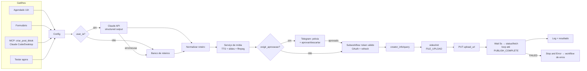

# Post automático no TikTok com n8n e IA

Fluxo low-code no **n8n** que, sozinho, cria e publica vídeos curtos no TikTok:

1. escolhe o tema (agendado, formulário, ou pedido em linguagem natural via **MCP**);
2. **IA (Claude)** escreve o roteiro: gancho, cenas, narração, CTA e hashtags (JSON validado por schema);
3. gera o **vídeo 9:16**: narração neural pt-BR, slides com legenda, zoom e transições, H.264/AAC;
4. (opcional) manda a prévia no **Telegram** para aprovação humana;
5. publica pela **TikTok Content Posting API** oficial (Direct Post), acompanha o processamento e registra
   tudo num log; erros caem num workflow de tratamento.

Inspirado no vídeo de referência ("This n8n AI Agent will AUTOMATE your Social Media"). As melhorias em
relação a ele estão na tabela [Diferenciais](#diferenciais).


Vídeo gerado pelo fluxo: [`assets/exemplo_golpe_do_boleto.mp4`](assets/exemplo_golpe_do_boleto.mp4) (27,8 s).

## Arquitetura



### Workflows (`workflows/`)

| Arquivo | O que faz |
|---|---|
| `01_tiktok_post_automatico.json` | Fluxo principal (30 nós): gatilhos → roteiro → vídeo → aprovação → publicação → log |
| `02_tiktok_autenticacao.json` | OAuth do TikTok: `GET /webhook/tiktok/login` (redireciona), `GET /webhook/tiktok/callback` (troca `code` por token, valida `state`) e subworkflow que entrega um `access_token` válido, renovando com `refresh_token` |
| `03_tiktok_erros.json` | *Error Trigger*: registra falha, nó e link da execução (ponto para plugar alerta) |
| `04_tiktok_mcp_server.json` | **Servidor MCP** em `/mcp/tiktok` com as ferramentas `criar_post_tiktok(tema)` e `historico_publicacoes()` |

Os JSONs são gerados por `workflows/src/build.py` (fluxo como código, revisável em PR). O prompt do roteiro
está em `workflows/src/prompt_roteiro.md` e o banco de roteiros em `workflows/src/banco_roteiros.js`.

### Serviço de mídia (`media_service/`)

Pequeno serviço HTTP local (Python stdlib) que o n8n chama via *HTTP Request*:

| Rota | Função |
|---|---|
| `POST /render` | Roteiro → `video.mp4` 1080×1920 + capa. Narração com **edge-tts** (voz neural pt-BR gratuita); slides com Pillow; montagem com ffmpeg |
| `GET/POST /tokens` | Guarda tokens OAuth (arquivo local fora do git) |
| `GET/POST /log` | Histórico de publicações (CSV) |
| `/mock-tiktok/...` | **Simulador da Content Posting API** com os mesmos endpoints e contratos (valida `Content-Range`, tamanho, `SELF_ONLY` para app não auditado) |

Por que um serviço em vez do nó *Execute Command*: o n8n 2.x bloqueia esse nó por padrão. Com HTTP, o mesmo
desenho funciona com n8n em Docker ou na nuvem, sem acesso ao disco do servidor.

## Como rodar

Pré-requisitos: Python 3.10+, ffmpeg no PATH e **Node 24** (exigido pelo n8n 2.x). O Node pode ser
portátil, sem mexer no Node do sistema:

```powershell
# Node 24 portátil + n8n local (uma vez)
# baixe https://nodejs.org/dist/latest-v24.x/node-v24.*-win-x64.zip e extraia em $HOME\tools\node24
$env:PATH = "$HOME\tools\node24;$env:PATH"
mkdir $HOME\tools\n8n; cd $HOME\tools\n8n; npm init -y; npm install n8n

# dependências Python do serviço de mídia
pip install -r requirements.txt

cd <repo>\desafio2-tiktok-n8n
.\importar.ps1          # importa os 4 workflows
.\iniciar.ps1           # sobe serviço de mídia (porta 8765) + n8n (porta 5678)
```

No n8n (<http://localhost:5678>), clique em **Publish** nos 4 workflows. Depois:

1. **Conectar conta (simulador):** abra
   `http://localhost:5678/webhook/tiktok/callback?code=teste&state=case-gogroup-csrf`. Para a conta real,
   siga [docs/setup-tiktok.md](docs/setup-tiktok.md).
2. **Publicar:** escolha uma opção:
   - botão *Execute workflow* em "Testar agora";
   - formulário (URL de produção do nó "Formulário");
   - via MCP: `python scripts/testar_mcp.py "golpe do boleto"`.

### Painel de controle (nó **Config**)

| Campo | Padrão | Efeito |
|---|---|---|
| `usar_ia` | `false` | `true` usa o Claude para o roteiro (exige credencial **Anthropic** no nó "Claude: gerar roteiro") |
| `modelo` | `claude-opus-5-5` | Modelo do roteiro |
| `exigir_aprovacao` | `false` | `true` envia prévia ao Telegram e espera aprovação (ative os 2 nós Telegram e a credencial do bot) |
| `privacidade_preferida` | `SELF_ONLY` | Usada se estiver entre as opções retornadas por `creator_info` |
| `marca` | `@automacao.na.pratica` | Handle exibido no vídeo |

A troca **simulador ↔ API real** é um único campo: `api_base` no workflow de autenticação.

## Integração MCP

Com o workflow `TikTok · Servidor MCP` publicado, qualquer cliente MCP cria posts em linguagem natural:

```bash
claude mcp add --transport http tiktok-n8n http://localhost:5678/mcp/tiktok
# no Claude Code: "publica um vídeo sobre golpe do boleto e me mostra o histórico"
```

## Testes realizados

Ambiente: n8n 2.41.7 local, Node 24.21, modo simulador.

| Cenário | Como | Resultado |
|---|---|---|
| Ponta a ponta via MCP | `scripts/testar_mcp.py "golpe do boleto"` | `PUBLISH_COMPLETE`, vídeo de 27,8 s, 845.748 bytes enviados por PUT e conferidos no simulador |
| OAuth: login | `GET /webhook/tiktok/login` | 307 para `tiktok.com/v2/auth/authorize` com `client_key`, escopos, `redirect_uri` e `state` |
| OAuth: callback | `code` + `state` corretos / `state` errado | Tokens salvos / HTTP 400 |
| Renovação de token | `expira_em` forçado para 0 | Renovado via `refresh_token` (válido por +24 h), post concluído |
| Conta desconectada | tokens apagados | Erro claro no MCP; workflow de erros registrou nó, mensagem e link da execução |
| Falha da IA | `usar_ia=true` sem credencial | Nó do Claude falhou e caiu no banco de roteiros; post publicado mesmo assim |

Log de exemplo: [`assets/exemplo_log_publicacoes.csv`](assets/exemplo_log_publicacoes.csv).

**Ainda não validado:** publicação na conta real (depende do app aprovado no TikTok for Developers e do
túnel HTTPS), geração de roteiro pelo Claude (depende de chave de API) e aprovação via Telegram (depende
de bot). Todos já estão no fluxo e documentados.

## Diferenciais

| Vídeo de referência | Este fluxo |
|---|---|
| Publica direto | Aprovação humana opcional (Telegram *send-and-wait*) |
| Depende 100% da IA | *Fallback* para banco de roteiros se a IA falhar ou recusar |
| Saída de IA em texto livre | *Structured output* com JSON Schema: sem parsing frágil |
| Ferramentas pagas de vídeo | Vídeo montado localmente, custo zero (TTS neural gratuito + ffmpeg) |
| — | Respeita regras da API: `creator_info` antes de postar, `is_aigc=true`, polling de status |
| — | OAuth completo com `state` anti-CSRF e renovação automática do token |
| — | Workflow de erros + log de cada publicação |
| — | Servidor MCP: publicar conversando com o Claude |
| — | Simulador da API para testar sem esperar a aprovação do app |

## Custos

| Item | Custo |
|---|---|
| n8n self-hosted, edge-tts, ffmpeg, TikTok API | R$ 0 |
| Claude (roteiro, ~1,5k tokens de entrada / ~1k de saída por vídeo, Opus 5.5) | ≈ US$ 0,03 por vídeo; 30 vídeos/mês ≈ US$ 1 |
| Opcional: túnel com domínio fixo (ngrok) / VPS para rodar 24 h | US$ 0–10/mês |

## Limitações

- **App não auditado:** só posta `SELF_ONLY` (privado). Posts públicos exigem auditoria do app.
- **Rate limit da API:** 6 requisições/min por token. O fluxo faz 1 post por execução, com *polling* de 5 s.
- **Vídeos < 64 MB:** upload em 1 chunk. Os vídeos gerados têm cerca de 1 MB.
- **Fora do n8n:** tokens e log ficam no serviço local. Em produção, usar n8n Credentials/Data Tables ou
  banco de dados.
